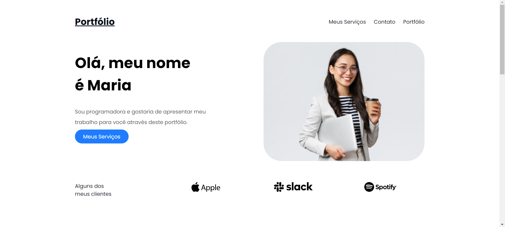

# Portfólio

## Sobre

Esse portfólio foi criado com base no curso **Introdução a HTML + CSS** da *Escola DNC* ao qual concluí esse projeto. Para além do curso, fiz algumas pequenas modificações no projeto e adicionei a responsividade do layout para smartphones utilizando Media Queries.

Gostaria de compartilhar o resultado do meu trabalho, você pode conferir o site neste link: [Portfólio](https://futurodevleo.github.io/escoladnc-portfolio/)

## Tecnologias utilizadas
